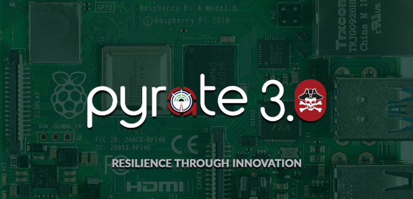

# Raspberry Pi Pyrate
{:.no_toc}

* TOC
{:toc}

User Guide for Raspberry Pi Pyrate Software

Check the [changelog](https://openbroadcaster.com/changelog) for new features.

## Pyrate Setup

Step by Step usere guide for running Pyrate software on Raspberry Pi

__Disclaimer__

\*\*\* Using this IMG is 100% at your own risk \*\*\*

This is an advanced experimenters machine, with the potential to generate a lot of bandwidth traffic when exposed to external internet and publish content to public mount points including LIVE radio and TV transmitters.  Default Administrative passwords are all enabled.  Recommend separating and isolating this behind a firewall until you are 100% confident what it is doing.

__Always change the passwords from the defaults__

## Getting Ready

You will need:

- Raspberry PI, Keyboard and Mouse

- 8 GB SD card (Minimum Size)

## Install the IMG

- Step one: download and install [etcher](https://etcher.io/)
- Step two: open etcher and write the image file to the SD card.
- Step three: Attach a Monitor, Keyboard and Network cable. Pop in the SD card and boot the Pyrate Box.

__First boot__

On fresh new install, give it a few minute for heartbeats and audio to appear. It is taking time to sync up. On first boot you may see some red error messages, on restart they should go away. See Debug mode in the status tab if errors persist.

__Crypto Mining Malware__

Raspberry Pi's are vulnerable to this kind of malware.  We have removed default user "pi" among other measures. What we have noticed, is compromised Pi's get ZMap and sshpass installed. Neither of these programs is required for our operation.

## Post Installation

In dashboard, check for updates in player dashboard.  
First run will come up at a default login prompt. user = obsuser  pass = test1234.  
Everything is now accessed through a browser and services will automatically restart when the unit is plugged in.

## Media Server

Find Pyrate ip and access via a browser on a different machine as a regular web site.  Login screen will appear on port 80.   There are several sample accounts with different permissions already created

user = admin       pass = test1234

user = basic        pass = test1234

user = manager  pass = test1234

To update the server from a browser while logged in as real admin user <IP_OF_SERVER>/updates

## Player DashBoard

Find its ip and access via login with web browser Chrome, Firefox or Safari from another machine on same network using the default port "23233" Player dashboard will show red errors, on first run, reset the box once more and these will go away.

http://<IP_ADDRESS>:23233 or http://192.168.1.100:23233

user = admin  pass = admin  (Displays a RED message to remind you to change)

## Icecast Streaming Server

http://<IP_ADDRESS>:8000 or http://192.168.1.100:8000

__Icecast Passwords__

Edit the file directly in Terminal and change passwords.

sudo /etc/icecast2/icecast.xml

Here are the default passwords that are already set in your image for testing.  Recommended that these be changed, otherwise you will get your stream\system hacked.

ICECAST_ADMIN_PASS="1c3c4stP4ssw0rD"  to access the administration panel
ICECAST_SOURCE_PASS="1c3c4stS0uRc3" to allow incoming streams to create a mount point

__Terminal Mode__

All operation of both player and server can be run and accessed from terminal

System  user = obsuser pass=test1234 (forces user to reset password on first run, root account disabled by default)

## Networking

How do I find the IP of player?

Default setup is to receive automatic DHCP address when plugged into a router.

There are a couple of ways to find its IP address

1) from the terminal on boot screen, "ip addr show" will display the DHCP address assigned to player box.

Network card is enp1s0 or eth0. Look beside inet for your assigned IP Address ie: 192.168.X.X

2) login to your router and show DHCP tables of devices with auto IP address.  our Player device hostname is "raspberrypi" and its IP will be displayed

__Set a static IP address__

Once you have setup and configured, you can optionally  or bind router to your MAC Address.

* Note # means that line is commented out.

From terminal.

"sudo nano /etc/network/interfaces"

__Before__

(Default for DHCP)

\# The loopback network interface
auto lo
iface lo inet loopback

\# The primary network interface
allow-hotplug enp1s0
iface enp1s0 inet dhcp

__After__

Substituting your own IP, gateway and DNS

\# The loopback network interface
auto lo
iface lo inet loopback

\# The primary network interface
allow-hotplug enp0s1
\#iface enp1s0 inet dhcp

iface enp1s0 inet static

address   192.168.1.10
netmask   255.255.255.0
gateway   192.168.1.1
dns-nameservers 192.168.1.1,8.8.8.8

Ctrl +X, Y (to save) Reboot machine

__Sound Cards__

Additional control of soundcard using Pulse is to go into Terminal and type "pulsemixer"

## Limitations

There is no local mail server configured. This prevents "forgot password" and "create new account" (on the welcome screen) from working since they require confirmation emails. You can create accounts using admin -> user management once logged in instead. Instructions to setup and configuring SMTP relay settings for [GSuite](https://support.google.com/a/answer/2956491?hl=en)

- Allowed Senders should be: "Only addresses in my domains"

- For authentication, limit to the server IP or set up a username/password ("Require SMTP Authentication")

- "Require TLS Encryption" is also a good idea.

- Pulse Audio is not present in dashboard.

- Mbrola voices in Alert player not installed.

- Updates not working through dashboard.

- Not tested at this time for anything other than generating an audio stream to Icecast server.

We'll include and expand on above in future releases.  If you have anything to share please contact us or pyrate@openbroadcaster.com

# Tips and Tricks

Have a tip to share? Send you stories by [email](mailto:pyrate@openbroadcaster.com)
